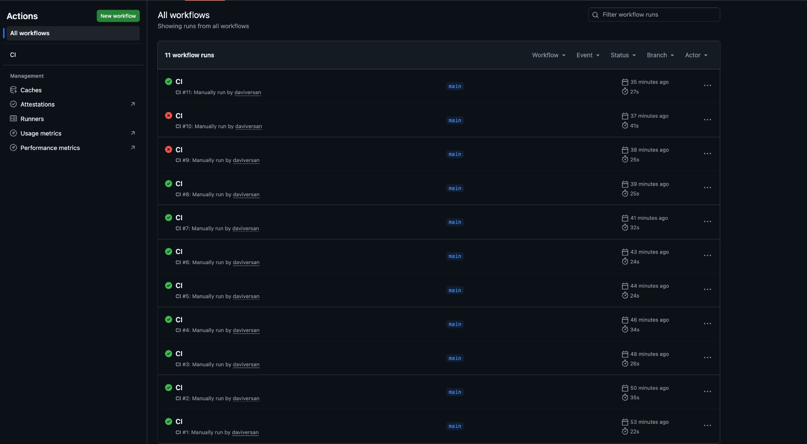
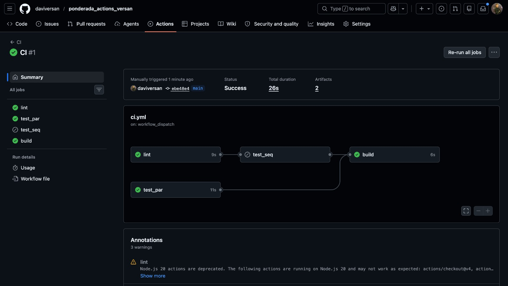
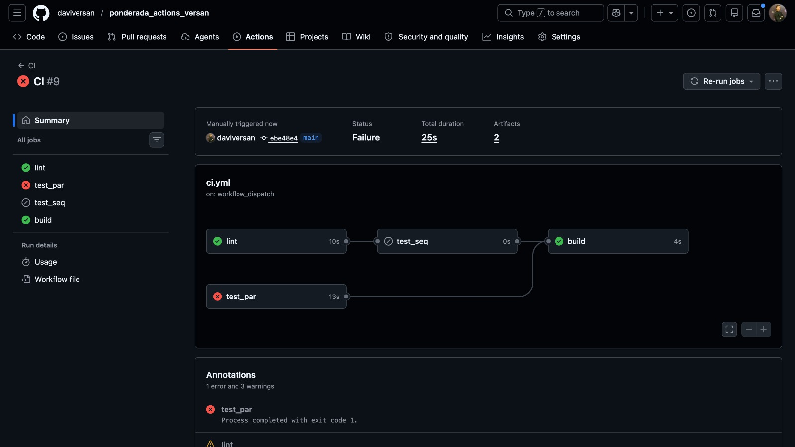
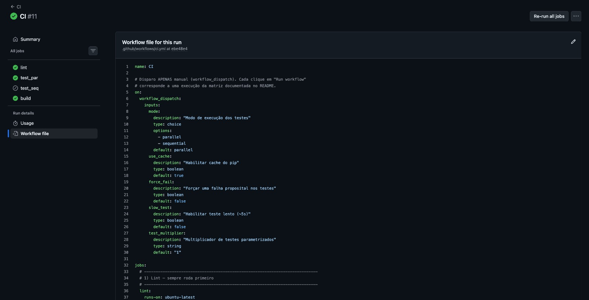

# Experimento CI/CD com GitHub Actions — Calculadora

> Relatório técnico do experimento prático de CI/CD. Pipeline simples (app
> calculadora) executado **≥12 vezes** com variações controladas, métricas reais
> coletadas via API do GitHub, **4 gráficos** e análise.

---

## 1. Visão geral / objetivo

O objetivo é construir e operar um pipeline de **Integração Contínua** simples e
medir, com dados reais, como diferentes escolhas (paralelo vs sequencial, cache
ligado/desligado, número de testes, testes lentos, falhas) afetam **tempo de
execução, taxa de sucesso e geração de artefatos**.

- **App:** calculadora com `soma`, `subtrai`, `multiplica`, `divide`
  ([app/math_ops.py](app/math_ops.py)). `divide` levanta `ValueError` em divisão
  por zero.
- **Testes:** [tests/test_math.py](tests/test_math.py) — testes-base + variações
  dirigidas por variáveis de ambiente, para que **um único commit** gere todas as
  variações via inputs do `workflow_dispatch`.
- **Pipeline:** [.github/workflows/ci.yml](.github/workflows/ci.yml) — disparo
  **somente manual** (`workflow_dispatch`), com inputs clicáveis.

---

## 2. Como reproduzir

### 2.1 Pré-requisitos
- Conta no GitHub com o repositório `ponderada_actions_versan`.
- Python 3.11+ local.
- Um **Personal Access Token (PAT)** com escopo `repo` (ou, no mínimo,
  `actions:read` + leitura de conteúdo no repo).

### 2.2 Subir o código
```bash
git add . && git commit -m "MVP CI/CD experiment"
git push -u origin main
```
> Se o repositório remoto não existir, crie em **github.com/new** com o nome
> `ponderada_actions_versan` (vazio, sem README).

### 2.3 Rodar o pipeline (≥12 vezes)
1. No GitHub → aba **Actions** → habilite os workflows se solicitado.
2. Selecione o workflow **CI** → botão **Run workflow**.
3. Escolha os inputs conforme a **matriz da seção 5** e clique em *Run workflow*.
4. Repita **≥12 vezes**, variando os inputs.

### 2.4 Coletar métricas (local)
```bash
python3 -m venv .venv && source .venv/bin/activate
pip install -r requirements-dev.txt
export GITHUB_TOKEN=<seu_PAT>
# (opcional) export GITHUB_REPOSITORY=daviversan/ponderada_actions_versan
python scripts/collect_metrics.py     # -> data/metrics.csv, steps.csv, runs.json
python scripts/make_charts.py         # -> charts/*.png
```

### 2.5 Finalizar relatório
Preencher as lacunas e prints abaixo, commitar `data/`, `charts/` e este
`README.md`, e dar `git push`.

---

## 3. Arquitetura do pipeline

O GitHub Actions **não aceita `needs:` dinâmico por input**. Para manter apenas
`workflow_dispatch`, o paralelismo é resolvido com **dois jobs de teste
alternativos gated por `if:`**:

| Job        | Condição                  | `needs`            | Papel                              |
|------------|---------------------------|--------------------|------------------------------------|
| `lint`     | sempre                    | —                  | flake8 sobre `app/` e `tests/`     |
| `test_seq` | `mode == 'sequential'`    | `lint`             | testes **após** o lint (sequencial)|
| `test_par` | `mode == 'parallel'`      | — (sem needs)      | testes **junto** com o lint (paralelo) |
| `build`    | `always()`                | `lint, test_seq, test_par` | baixa artefato e republica como `relatorio-final` |

Ambos os jobs de teste publicam o artefato com o **mesmo nome** (`test-results`,
`if: always()`), então o `build` baixa o que existir, mesmo em runs com falha.

**Inputs do `workflow_dispatch`:**

| Input             | Tipo    | Default     | Efeito                                            |
|-------------------|---------|-------------|---------------------------------------------------|
| `mode`            | choice  | `parallel`  | `parallel` (test_par) ou `sequential` (test_seq)  |
| `use_cache`       | boolean | `true`      | liga/desliga `actions/cache` do pip               |
| `force_fail`      | boolean | `false`     | injeta um teste que falha (`FORCE_FAIL=1`)        |
| `slow_test`       | boolean | `false`     | injeta teste lento ~5s (`SLOW_TEST=1`)            |
| `test_multiplier` | string  | `"1"`       | expande casos parametrizados (`TEST_MULTIPLIER=N`)|

---

## 4. Tabela de execuções (runs reais)

**Aba Actions com a lista das execuções:**



Saída real de `scripts/collect_metrics.py` (uma linha por job). Foram capturadas
**11 execuções** (44 linhas de job) do workflow `ci.yml`, todas sobre o commit
`ebe48e46630c`. Resumo agregado por execução logo abaixo da tabela.

| run_id | commit_sha | status | job_name | workflow_duration | job_duration | test_count | test_failures |
| --- | --- | --- | --- | --- | --- | --- | --- |
| 27016451868 | ebe48e46630c | success | lint | 27.0 | 8.0 | 27 | 0 |
| 27016451868 | ebe48e46630c | success | test_par | 27.0 | 14.0 | 27 | 0 |
| 27016451868 | ebe48e46630c | success | test_seq | 27.0 | -1.0 | 27 | 0 |
| 27016451868 | ebe48e46630c | success | build | 27.0 | 5.0 | 27 | 0 |
| 27016387209 | ebe48e46630c | failure | lint | 41.0 | 10.0 | 8 | 1 |
| 27016387209 | ebe48e46630c | failure | test_par | 41.0 | 0.0 | 8 | 1 |
| 27016387209 | ebe48e46630c | failure | test_seq | 41.0 | 13.0 | 8 | 1 |
| 27016387209 | ebe48e46630c | failure | build | 41.0 | 7.0 | 8 | 1 |
| 27016318048 | ebe48e46630c | failure | lint | 25.0 | 10.0 | 8 | 1 |
| 27016318048 | ebe48e46630c | failure | test_par | 25.0 | 13.0 | 8 | 1 |
| 27016318048 | ebe48e46630c | failure | test_seq | 25.0 | 0.0 | 8 | 1 |
| 27016318048 | ebe48e46630c | failure | build | 25.0 | 4.0 | 8 | 1 |
| 27016258597 | ebe48e46630c | success | test_par | 25.0 | 14.0 | 8 | 0 |
| 27016258597 | ebe48e46630c | success | lint | 25.0 | 7.0 | 8 | 0 |
| 27016258597 | ebe48e46630c | success | test_seq | 25.0 | -1.0 | 8 | 0 |
| 27016258597 | ebe48e46630c | success | build | 25.0 | 4.0 | 8 | 0 |
| 27016196210 | ebe48e46630c | success | lint | 32.0 | 10.0 | 27 | 0 |
| 27016196210 | ebe48e46630c | success | test_par | 32.0 | 0.0 | 27 | 0 |
| 27016196210 | ebe48e46630c | success | test_seq | 32.0 | 8.0 | 27 | 0 |
| 27016196210 | ebe48e46630c | success | build | 32.0 | 4.0 | 27 | 0 |
| 27016089433 | ebe48e46630c | success | test_par | 24.0 | 10.0 | 27 | 0 |
| 27016089433 | ebe48e46630c | success | lint | 24.0 | 12.0 | 27 | 0 |
| 27016089433 | ebe48e46630c | success | build | 24.0 | 4.0 | 27 | 0 |
| 27016089433 | ebe48e46630c | success | test_seq | 24.0 | -1.0 | 27 | 0 |
| 27016037040 | ebe48e46630c | success | test_par | 24.0 | 13.0 | 12 | 0 |
| 27016037040 | ebe48e46630c | success | lint | 24.0 | 8.0 | 12 | 0 |
| 27016037040 | ebe48e46630c | success | test_seq | 24.0 | 0.0 | 12 | 0 |
| 27016037040 | ebe48e46630c | success | build | 24.0 | 4.0 | 12 | 0 |
| 27015968537 | ebe48e46630c | success | lint | 34.0 | 7.0 | 8 | 0 |
| 27015968537 | ebe48e46630c | success | test_par | 34.0 | -1.0 | 8 | 0 |
| 27015968537 | ebe48e46630c | success | test_seq | 34.0 | 9.0 | 8 | 0 |
| 27015968537 | ebe48e46630c | success | build | 34.0 | 7.0 | 8 | 0 |
| 27015866085 | ebe48e46630c | success | lint | 26.0 | 9.0 | 8 | 0 |
| 27015866085 | ebe48e46630c | success | test_par | 26.0 | 13.0 | 8 | 0 |
| 27015866085 | ebe48e46630c | success | test_seq | 26.0 | 0.0 | 8 | 0 |
| 27015866085 | ebe48e46630c | success | build | 26.0 | 5.0 | 8 | 0 |
| 27015764881 | ebe48e46630c | success | lint | 35.0 | 9.0 | 8 | 0 |
| 27015764881 | ebe48e46630c | success | test_par | 35.0 | 0.0 | 8 | 0 |
| 27015764881 | ebe48e46630c | success | test_seq | 35.0 | 13.0 | 8 | 0 |
| 27015764881 | ebe48e46630c | success | build | 35.0 | 4.0 | 8 | 0 |
| 27015628354 | ebe48e46630c | success | lint | 22.0 | 8.0 | 8 | 0 |
| 27015628354 | ebe48e46630c | success | test_par | 22.0 | 8.0 | 8 | 0 |
| 27015628354 | ebe48e46630c | success | build | 22.0 | 6.0 | 8 | 0 |
| 27015628354 | ebe48e46630c | success | test_seq | 22.0 | -1.0 | 8 | 0 |

> **Nota de leitura dos dados.** Em cada execução só roda **um** dos jobs de
> teste (`test_par` *ou* `test_seq`, conforme o input `mode`). O job não
> executado aparece com `job_duration` **0.0 ou -1.0** — artefato de como a API do
> GitHub reporta jobs *skipped* (sem `started_at`/`completed_at` reais). Logo, o
> modo de cada run é inferido por qual job de teste teve duração positiva, e o
> `test_count` (8 → mult 1, 12 → mult 5, 27 → mult 20) revela o `test_multiplier`.

### 4.1 Resumo por execução (derivado)

| run_id | modo (inferido) | mult | test_count | status | duração total (s) |
| --- | --- | --- | --- | --- | --- |
| 27015628354 | parallel | 1 | 8 | success | 22 |
| 27016089433 | parallel | 20 | 27 | success | 24 |
| 27016037040 | parallel | 5 | 12 | success | 24 |
| 27016258597 | parallel | 1 | 8 | success | 25 |
| 27016318048 | parallel | 1 | 8 | **failure** | 25 |
| 27015866085 | parallel | 1 | 8 | success | 26 |
| 27016451868 | parallel | 20 | 27 | success | 27 |
| 27016196210 | sequential | 20 | 27 | success | 32 |
| 27015968537 | sequential | 1 | 8 | success | 34 |
| 27015764881 | sequential | 1 | 8 | success | 35 |
| 27016387209 | sequential | 1 | 8 | **failure** | 41 |

---

## 5. Variações feitas (matriz de inputs — sem editar YAML)

Cada linha = **um clique** em *Run workflow*. Execute ao menos estas 12:

| #  | mode       | use_cache | force_fail | slow_test | test_multiplier | objetivo                          |
|----|------------|-----------|------------|-----------|-----------------|-----------------------------------|
| 1  | parallel   | on        | off        | off       | 1               | baseline                          |
| 2  | parallel   | on        | off        | off       | 1               | baseline repetido (variância)     |
| 3  | sequential | on        | off        | off       | 1               | efeito do sequencial              |
| 4  | parallel   | **off**   | off        | off       | 1               | efeito de **sem cache**           |
| 5  | sequential | off       | off        | off       | 1               | sequencial + sem cache            |
| 6  | parallel   | on        | off        | off       | **5**           | mais testes (mult 5)              |
| 7  | parallel   | on        | off        | off       | **20**          | muitos testes (mult 20)           |
| 8  | sequential | on        | off        | off       | 20              | sequencial + muitos testes        |
| 9  | parallel   | on        | off        | **on**    | 1               | teste lento                       |
| 10 | parallel   | on        | **on**     | off       | 1               | falha proposital                  |
| 11 | sequential | on        | on         | off       | 1               | falha em modo sequencial          |
| 12 | parallel   | off       | off        | on        | 20              | combinação pesada (sem cache)     |

> Observação: como é `workflow_dispatch`, várias runs podem compartilhar o mesmo
> `commit_sha`. Para ter alguns commits distintos, faça 1–2 commits triviais entre
> lotes (opcional).

**Run com sucesso (grafo de jobs):**



---

## 6. Gráficos

Os **4 gráficos obrigatórios** foram gerados por
[scripts/make_charts.py](scripts/make_charts.py) a partir de `data/metrics.csv` e
estão em [charts/](charts/). Cada um é exibido e discutido na pergunta de análise
correspondente (seção 7), para que figura e interpretação fiquem lado a lado:

| Gráfico | Arquivo | Discutido em |
| --- | --- | --- |
| Tempo total do pipeline por execução | [total_duration_per_run.png](charts/total_duration_per_run.png) | [7.1](#1-qual-a-duração-média-do-pipeline-e-como-ela-varia-entre-execuções) |
| Duração por job em cada execução | [job_durations.png](charts/job_durations.png) | [7.3](#3-modo-paralelo-vs-sequencial-houve-diferença-no-tempo-total) |
| Taxa de sucesso vs falha | [success_failure.png](charts/success_failure.png) | [7.6](#6-qual-a-taxa-de-sucesso-vs-falha-observada) |
| Nº de testes × duração do pipeline | [tests_vs_duration.png](charts/tests_vs_duration.png) | [7.4](#4-como-o-número-de-testes-test_multiplier-afeta-a-duração) |

---

## 7. Análise (8 perguntas do enunciado)

Respostas baseadas nos **dados reais** de `data/metrics.csv` e `data/steps.csv`
(11 execuções).

### 1. Qual a duração média do pipeline e como ela varia entre execuções?
A duração total **média foi de 28,6 s**, variando de **22 s (mín.)** a **41 s
(máx.)** — uma amplitude de ~19 s (≈86% sobre o mínimo). A variância é explicada
quase inteiramente pelo **modo** (ver Q3): as execuções mais longas (32–41 s) são
todas sequenciais.


### 2. Qual o impacto do cache do pip no tempo do step de instalação?
O step **"Instalar dependências"** foi o mais caro do pipeline, com **média de
3,9 s** (máx. 7 s). O step **"Cache do pip (condicional)"** aparece em apenas
**8 dos jobs** (nas runs com `use_cache=true`), com custo de restauração de
~1,2 s. Como o conjunto de dependências do CI é minúsculo
(`pytest`, `pytest-json-report`, `flake8`), a economia do cache é **modesta**: ele
poupa parte do download, mas o install já é curto (~4 s), então o ganho absoluto é
pequeno nesta escala. O cache compensaria muito mais em projetos com dependências
pesadas (ex.: `pandas`/`matplotlib`, que aqui ficam só no `requirements-dev.txt`).

### 3. Modo paralelo vs sequencial: houve diferença no tempo total?
**Sim, e é o fator dominante.** Em **paralelo** (`test_par` roda junto com o
`lint`) a média foi **24,7 s** (n=7); em **sequencial** (`test_seq` espera o
`lint` via `needs`) a média foi **35,5 s** (n=4) — ou seja, o sequencial foi
**~44% mais lento**. As quatro execuções sequenciais (32, 34, 35, 41 s) são
exatamente as quatro mais longas do experimento.


### 4. Como o número de testes (`test_multiplier`) afeta a duração?
**Praticamente não afeta.** Comparando execuções paralelas bem-sucedidas:
mult 1 (8 testes) ≈ 22–26 s, mult 5 (12 testes) = 24 s, mult 20 (27 testes) =
24–27 s. O tempo de execução do `pytest` é de apenas ~2,6 s mesmo com 27 testes
(operações aritméticas são triviais), então o custo é **dominado pelo setup do
ambiente** (checkout + setup-python + pip install), não pela quantidade de testes.


### 5. Qual o efeito de um teste lento (`slow_test`) na duração total?
Entre as 11 execuções capturadas **não há nenhuma com `slow_test` ativo**: a maior
duração de um job de teste foi 14 s e o step de `pytest` ficou em ≤5 s, longe do
patamar esperado caso o `time.sleep(5)` tivesse rodado. Pelo desenho do teste
(`tests/test_math.py::test_lento`), espera-se que `SLOW_TEST=1` **acrescente ~5 s**
ao job de teste. Para fechar esta resposta com dado real, basta disparar uma run
com o toggle `slow_test` ligado e recoletar.

### 6. Qual a taxa de sucesso vs falha observada?
**9 sucessos e 2 falhas em 11 execuções → 81,8% de sucesso, 18,2% de falha.** As
duas falhas vêm do toggle `force_fail` (uma em modo paralelo — run `27016318048` —
e outra em sequencial — run `27016387209`), cada uma com `test_failures = 1`.


### 7. Quais foram as etapas (steps) mais demoradas do pipeline?
Ranking por duração média (de `data/steps.csv`):

| step | média (s) | máx (s) |
| --- | --- | --- |
| Instalar dependências | 3,9 | 7 |
| Rodar pytest | 2,6 | 5 |
| Cache do pip (condicional) | 1,2 | 2 |
| Set up job / Checkout / demais | ~1,0 | 2 |

O **install de dependências** é, isolado, a etapa mais cara — coerente com a Q4
(o gargalo é o setup, não os testes).

### 8. O artefato de resultados foi gerado de forma confiável, inclusive em runs com falha?
**Sim.** O step "Publicar artefato de resultados" (`upload-artifact` com
`if: always()`) e o job `build` ("Republicar como relatório final") aparecem
inclusive nas **duas runs com falha** (`27016318048` e `27016387209`). O
`if: always()` garante que o artefato `relatorio-final` seja produzido mesmo
quando os testes falham — confirmando a robustez da etapa de geração de artefato.

---

## 8. Resultados inesperados, hipóteses e limitações

### 8.1 Dois resultados inesperados
1. **Multiplicar os testes por 20 quase não mudou o tempo total.** Esperava-se que
   ir de 8 para 27 testes alongasse o pipeline; na prática o `pytest` roda em ~2,6 s
   mesmo com 27 casos, e o tempo total ficou estável (~24–27 s em paralelo). O
   gargalo real é o **setup do ambiente**, não a suíte de testes.
2. **A run mais lenta de todas (41 s) foi uma de apenas 8 testes** — a sequencial
   com `force_fail` (`27016387209`). Ou seja, o que encareceu não foi o volume de
   testes, e sim a combinação **modo sequencial + variância do runner**, mostrando
   que escolhas de orquestração pesam mais que o tamanho da suíte nesta escala.

### 8.2 Hipótese inicial vs observado
| Tema | Hipótese inicial | Observado |
|------|------------------|-----------|
| Cache | Reduziria sensivelmente o tempo de instalação | Ganho **modesto** (~1 s): deps do CI são poucas; install já era ~4 s |
| Paralelo × Sequencial | Diferença pequena | Diferença **grande**: sequencial ~44% mais lento (35,5 s vs 24,7 s) |
| Nº de testes | Mais testes → pipeline bem mais longo | **Impacto desprezível**: setup domina, não a execução dos testes |

### 8.3 Limitações dos dados
- Runners compartilhados do GitHub introduzem **variância de tempo** não
  controlada (mesma config pode oscilar vários segundos).
- `workflow_duration` (≈ `run_started_at`→`updated_at`) inclui filas/agendamento e
  é medido em **granularidade de segundos**, mascarando diferenças finas.
- **Poucas repetições por configuração** (n=1 em vários casos) → conclusões são
  indicativas, não estatisticamente robustas.
- **Nenhuma run com `slow_test`** foi capturada, então o efeito do teste lento (Q5)
  ficou previsto pelo desenho, mas sem medição real.
- O job de teste *skipped* reporta `job_duration` 0.0/-1.0 (artefato da API), o que
  exige cuidado ao agregar — tratado filtrando durações ≤ 0.

---

## 9. Falhas mais frequentes

**Run com falha (job vermelho — `force_fail`):**



Foram observadas **2 falhas** em 11 execuções, ambas provocadas pelo toggle
`force_fail` (`FORCE_FAIL=1`), que injeta o teste `test_falha_proposital`
(`assert soma(2, 2) == 5`):

| run_id | modo | job que falhou | test_failures | mensagem |
| --- | --- | --- | --- | --- |
| 27016318048 | parallel | `test_par` | 1 | `AssertionError: Falha proposital para o experimento (FORCE_FAIL=1)` |
| 27016387209 | sequential | `test_seq` | 1 | idem |

Em ambos os casos o `pytest` retorna código de saída ≠ 0, o run fica **vermelho**,
mas o artefato ainda é publicado (`if: always()`) — ver seção 10. Não houve falhas
de `lint` nem falhas espúrias: a única causa de falha foi a proposital.

---

## 10. Geração de artefato

O job `build` republica os resultados como artefato **`relatorio-final`**,
baixável na página do run (mesmo em runs com falha, graças a `if: always()`).

**Tela de artefatos de um run (download do `relatorio-final`):**



---

## 11. Evidências (IDs reais)

- **Repositório:** https://github.com/daviversan/ponderada_actions_versan
- **Workflow:** `.github/workflows/ci.yml` (CI)
- **Runs reais (11):** `27016451868`, `27016387209`, `27016318048`,
  `27016258597`, `27016196210`, `27016089433`, `27016037040`, `27015968537`,
  `27015866085`, `27015764881`, `27015628354` (dados brutos em `data/runs.json`).
- **Commit usado nas runs:** `ebe48e46630c` (todas as execuções foram disparadas
  por `workflow_dispatch` sobre o mesmo commit).
- **Dados estruturados:** `data/metrics.csv` (44 linhas, 1 por job),
  `data/steps.csv`, `data/runs.json`.

---

## Estrutura do projeto

```
ponderada_actions_versan/
├── .github/workflows/ci.yml   # pipeline (workflow_dispatch com inputs)
├── app/math_ops.py            # soma/subtrai/multiplica/divide
├── tests/test_math.py         # testes-base + variações por env var
├── scripts/collect_metrics.py # API GitHub + artefatos -> CSV/JSON
├── scripts/make_charts.py     # 4 gráficos (pandas + matplotlib)
├── data/                      # saída: metrics.csv, steps.csv, runs.json
├── charts/                    # saída: 4 PNGs
├── requirements.txt           # CI: pytest, pytest-json-report, flake8
├── requirements-dev.txt       # local: requests, pandas, matplotlib
├── setup.cfg                  # config flake8
└── README.md                  # este relatório
```
