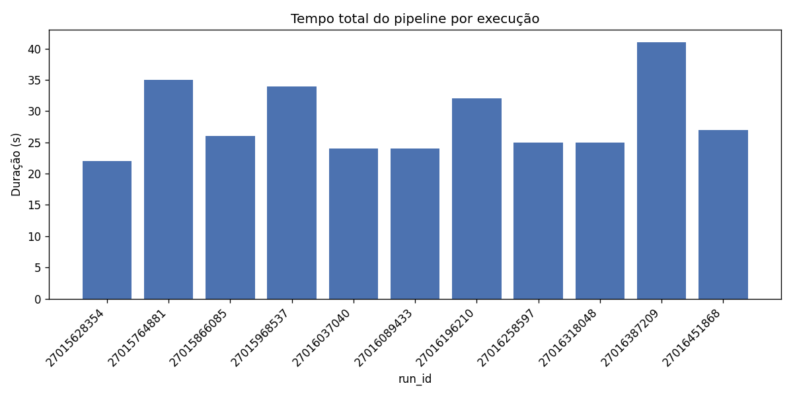
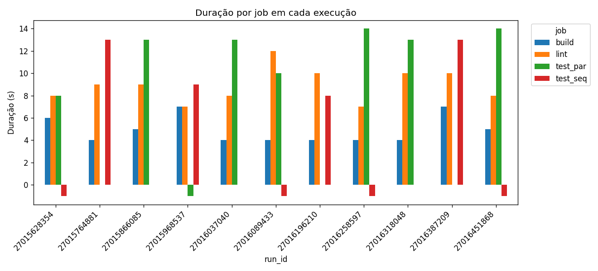
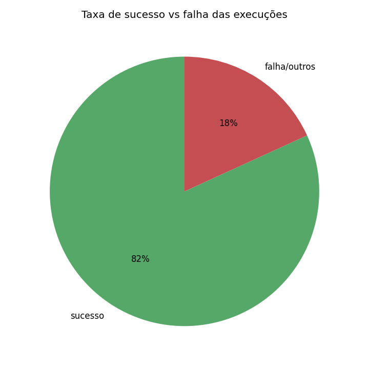
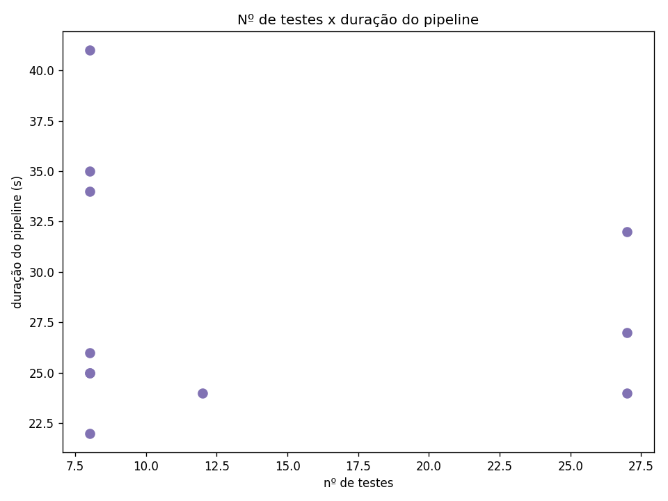

# Experimento CI/CD com GitHub Actions — Calculadora

> Relatório técnico do experimento prático de CI/CD. Pipeline simples (app
> calculadora) executado **≥12 vezes** com variações controladas, métricas reais
> coletadas via API do GitHub, **4 gráficos** e análise.

---

## 1. Visão geral / objetivo

O objetivo é construir e operar um pipeline de **Integração Contínua** simples e
medir, com dados reais, como diferentes escolhas (paralelo vs sequencial, cache
ligado/desligado, número de testes, testes lentos, falhas) afetam **tempo de
execução, taxa de sucesso e geração de artefatos**.

- **App:** calculadora com `soma`, `subtrai`, `multiplica`, `divide`
  ([app/math_ops.py](app/math_ops.py)). `divide` levanta `ValueError` em divisão
  por zero.
- **Testes:** [tests/test_math.py](tests/test_math.py) — testes-base + variações
  dirigidas por variáveis de ambiente, para que **um único commit** gere todas as
  variações via inputs do `workflow_dispatch`.
- **Pipeline:** [.github/workflows/ci.yml](.github/workflows/ci.yml) — disparo
  **somente manual** (`workflow_dispatch`), com inputs clicáveis.

---

## 2. Como reproduzir

### 2.1 Pré-requisitos
- Conta no GitHub com o repositório `ponderada_actions_versan`.
- Python 3.11+ local.
- Um **Personal Access Token (PAT)** com escopo `repo` (ou, no mínimo,
  `actions:read` + leitura de conteúdo no repo).

### 2.2 Subir o código
```bash
git add . && git commit -m "MVP CI/CD experiment"
git push -u origin main
```
> Se o repositório remoto não existir, crie em **github.com/new** com o nome
> `ponderada_actions_versan` (vazio, sem README).

### 2.3 Rodar o pipeline (≥12 vezes)
1. No GitHub → aba **Actions** → habilite os workflows se solicitado.
2. Selecione o workflow **CI** → botão **Run workflow**.
3. Escolha os inputs conforme a **matriz da seção 5** e clique em *Run workflow*.
4. Repita **≥12 vezes**, variando os inputs.

### 2.4 Coletar métricas (local)
```bash
python3 -m venv .venv && source .venv/bin/activate
pip install -r requirements-dev.txt
export GITHUB_TOKEN=<seu_PAT>
# (opcional) export GITHUB_REPOSITORY=daviversan/ponderada_actions_versan
python scripts/collect_metrics.py     # -> data/metrics.csv, steps.csv, runs.json
python scripts/make_charts.py         # -> charts/*.png
```

### 2.5 Finalizar relatório
Preencher as lacunas e prints abaixo, commitar `data/`, `charts/` e este
`README.md`, e dar `git push`.

---

## 3. Arquitetura do pipeline

O GitHub Actions **não aceita `needs:` dinâmico por input**. Para manter apenas
`workflow_dispatch`, o paralelismo é resolvido com **dois jobs de teste
alternativos gated por `if:`**:

| Job        | Condição                  | `needs`            | Papel                              |
|------------|---------------------------|--------------------|------------------------------------|
| `lint`     | sempre                    | —                  | flake8 sobre `app/` e `tests/`     |
| `test_seq` | `mode == 'sequential'`    | `lint`             | testes **após** o lint (sequencial)|
| `test_par` | `mode == 'parallel'`      | — (sem needs)      | testes **junto** com o lint (paralelo) |
| `build`    | `always()`                | `lint, test_seq, test_par` | baixa artefato e republica como `relatorio-final` |

Ambos os jobs de teste publicam o artefato com o **mesmo nome** (`test-results`,
`if: always()`), então o `build` baixa o que existir, mesmo em runs com falha.

**Inputs do `workflow_dispatch`:**

| Input             | Tipo    | Default     | Efeito                                            |
|-------------------|---------|-------------|---------------------------------------------------|
| `mode`            | choice  | `parallel`  | `parallel` (test_par) ou `sequential` (test_seq)  |
| `use_cache`       | boolean | `true`      | liga/desliga `actions/cache` do pip               |
| `force_fail`      | boolean | `false`     | injeta um teste que falha (`FORCE_FAIL=1`)        |
| `slow_test`       | boolean | `false`     | injeta teste lento ~5s (`SLOW_TEST=1`)            |
| `test_multiplier` | string  | `"1"`       | expande casos parametrizados (`TEST_MULTIPLIER=N`)|

---

## 4. Tabela de execuções (12+ runs reais)

> 📸 PRINT: aba **Actions** com a lista das 12+ execuções.

> Cole aqui a saída em markdown impressa por `scripts/collect_metrics.py`
> (uma linha por job, com `run_id` real, commit, status, durações e nº de testes):

<!-- COLAR_TABELA_COLLECT_METRICS_AQUI -->

| run_id | commit_sha | status | job_name | workflow_duration | job_duration | test_count | test_failures |
| ------ | ---------- | ------ | -------- | ----------------- | ------------ | ---------- | ------------- |
| _(preencher com a saída real do collect_metrics.py)_ | | | | | | | |

---

## 5. Variações feitas (matriz de inputs — sem editar YAML)

Cada linha = **um clique** em *Run workflow*. Execute ao menos estas 12:

| #  | mode       | use_cache | force_fail | slow_test | test_multiplier | objetivo                          |
|----|------------|-----------|------------|-----------|-----------------|-----------------------------------|
| 1  | parallel   | on        | off        | off       | 1               | baseline                          |
| 2  | parallel   | on        | off        | off       | 1               | baseline repetido (variância)     |
| 3  | sequential | on        | off        | off       | 1               | efeito do sequencial              |
| 4  | parallel   | **off**   | off        | off       | 1               | efeito de **sem cache**           |
| 5  | sequential | off       | off        | off       | 1               | sequencial + sem cache            |
| 6  | parallel   | on        | off        | off       | **5**           | mais testes (mult 5)              |
| 7  | parallel   | on        | off        | off       | **20**          | muitos testes (mult 20)           |
| 8  | sequential | on        | off        | off       | 20              | sequencial + muitos testes        |
| 9  | parallel   | on        | off        | **on**    | 1               | teste lento                       |
| 10 | parallel   | on        | **on**     | off       | 1               | falha proposital                  |
| 11 | sequential | on        | on         | off       | 1               | falha em modo sequencial          |
| 12 | parallel   | off       | off        | on        | 20              | combinação pesada (sem cache)     |

> Observação: como é `workflow_dispatch`, várias runs podem compartilhar o mesmo
> `commit_sha`. Para ter alguns commits distintos, faça 1–2 commits triviais entre
> lotes (opcional).

> 📸 PRINT: tela de **um run com sucesso** (grafo de jobs).

---

## 6. Gráficos

Gerados por [scripts/make_charts.py](scripts/make_charts.py) a partir de
`data/metrics.csv`.

### 6.1 Tempo total do pipeline por execução


### 6.2 Tempo por job em cada execução


### 6.3 Taxa de sucesso vs falha


### 6.4 Nº de testes × duração do pipeline


---

## 7. Análise (8 perguntas do enunciado)

> Responda com base nos **dados reais** coletados (preencher após as runs).

1. **Qual a duração média do pipeline e como ela varia entre execuções?**
   _(preencher)_
2. **Qual o impacto do cache do pip no tempo do step de instalação?**
   _(comparar runs #1/#2 com cache vs #4 sem cache)_

   > 📸 PRINT: comparação visual **com cache vs sem cache** (tempo do step de install).
3. **Modo paralelo vs sequencial: houve diferença no tempo total?**
   _(comparar #1 parallel vs #3 sequential)_
4. **Como o número de testes (`test_multiplier`) afeta a duração?**
   _(comparar #1 mult 1 vs #6 mult 5 vs #7 mult 20)_
5. **Qual o efeito de um teste lento (`slow_test`) na duração total?**
   _(comparar #1 vs #9)_
6. **Qual a taxa de sucesso vs falha observada?**
   _(usar gráfico 6.3; falhas vêm de `force_fail`)_
7. **Quais foram as etapas (steps) mais demoradas do pipeline?**
   _(usar `data/steps.csv`)_
8. **O artefato de resultados foi gerado de forma confiável, inclusive em runs com falha?**
   _(verificar `relatorio-final` baixável mesmo em run vermelho)_

---

## 8. Resultados inesperados, hipóteses e limitações

### 8.1 Dois resultados inesperados
1. _(preencher)_
2. _(preencher)_

### 8.2 Hipótese inicial vs observado
| Tema            | Hipótese inicial | Observado |
|-----------------|------------------|-----------|
| Cache           | _(preencher)_    | _(preencher)_ |
| Paralelo×Sequencial | _(preencher)_ | _(preencher)_ |
| Nº de testes    | _(preencher)_    | _(preencher)_ |

### 8.3 Limitações dos dados
- Runners compartilhados do GitHub introduzem variância de tempo não controlada.
- `workflow_duration` inclui filas/agendamento, não só execução pura.
- Poucas repetições por configuração → estatística limitada.
- _(adicionar outras)_

---

## 9. Falhas mais frequentes

> 📸 PRINT: tela de **um run com falha** (job vermelho — `force_fail`).

_(descrever as falhas observadas: tipo, em qual job, mensagem)_

---

## 10. Geração de artefato

O job `build` republica os resultados como artefato **`relatorio-final`**,
baixável na página do run (mesmo em runs com falha, graças a `if: always()`).

> 📸 PRINT: tela de **artefatos** de um run (download do `relatorio-final`).

---

## 11. Evidências (IDs reais)

- **Repositório:** https://github.com/daviversan/ponderada_actions_versan
- **Workflow:** `.github/workflows/ci.yml` (CI)
- **Runs reais:** _(colar 12+ `run_id` reais — ver `data/runs.json`)_
- **Commits reais:** _(colar SHAs reais usados nas runs)_

---

## Estrutura do projeto

```
ponderada_actions_versan/
├── .github/workflows/ci.yml   # pipeline (workflow_dispatch com inputs)
├── app/math_ops.py            # soma/subtrai/multiplica/divide
├── tests/test_math.py         # testes-base + variações por env var
├── scripts/collect_metrics.py # API GitHub + artefatos -> CSV/JSON
├── scripts/make_charts.py     # 4 gráficos (pandas + matplotlib)
├── data/                      # saída: metrics.csv, steps.csv, runs.json
├── charts/                    # saída: 4 PNGs
├── requirements.txt           # CI: pytest, pytest-json-report, flake8
├── requirements-dev.txt       # local: requests, pandas, matplotlib
├── setup.cfg                  # config flake8
└── README.md                  # este relatório
```
